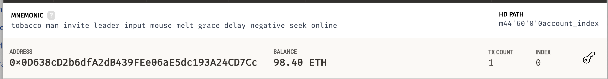
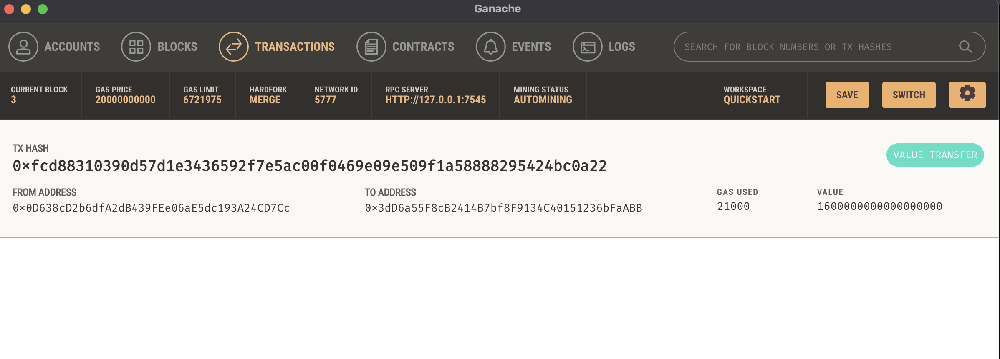
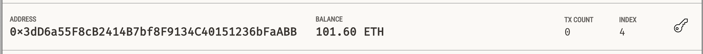

# Module-19-Challenge
This application aids users in hiring and directly paying Fintech Finders freelance developers using Streamlit in the front end and Ethereum techonology running in a testing blockchain environment through Ganache.

## Technologies

You will need to download Ganache on your computer to run a local testing blockchain environment. You will also need to download the following packages: Streamlit, Mnemonic, os, requests, and Web3.

## Application Testing

We did a test transaction to make sure that it works. User picked Kendall and paid her for 10 hours of her work. Below is evidence of the user account going down by the amount Kendall was hired for.

This is evidence of the transaction registed in the Ganache blockchain.

This is evidence of Kendall's account increasing.

